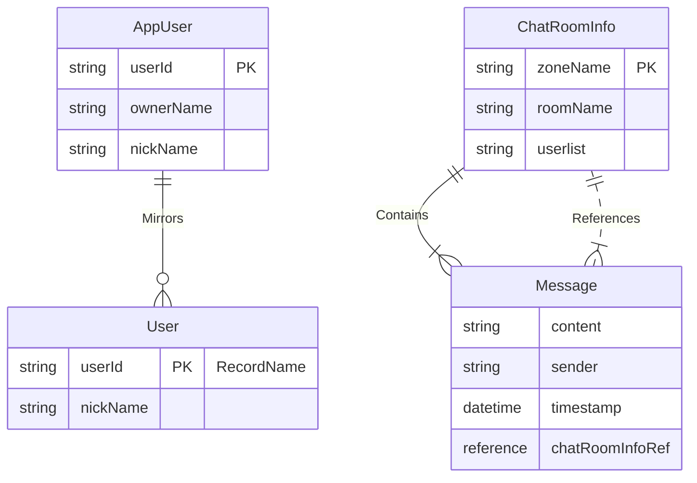

# CloudTalk 프로젝트

## 개요

CloudTalk는 Apple의 CloudKit 프레임워크를 활용하여 강력하고 안전한 비공개 통신을 제공하는 채팅 애플리케이션입니다. 사용자는 채팅방을 만들고, 다른 사람을 초대하고, 메시지를 교환할 수 있으며, 모든 데이터는 각자의 비공개 iCloud 계정에 안전하게 저장됩니다. 공유 채팅방은 CloudKit의 공유 기능을 활용하여 사용자 간의 협업을 가능하게 합니다.

## 프로젝트 아키텍처 및 폴더 구조

이 프로젝트는 SwiftUI의 최신 아키텍처 패턴인 **MVVM (Model-View-ViewModel)**을 기반으로 구성되어 있습니다. 이를 통해 UI 코드와 비즈니스 로직을 분리하여 코드의 재사용성, 테스트 용이성, 유지보수성을 높입니다.

주요 폴더와 그 역할은 다음과 같습니다.

-   **`CloudTalk/`**: 애플리케이션의 핵심 소스 코드가 위치하는 메인 그룹입니다.
    -   **`CloudTalkApp.swift`**: 앱의 생명주기를 관리하고 초기 뷰를 설정하는 진입점(Entry Point)입니다.
    -   **`AppDelegate.swift`**: 푸시 알림 등록 및 수신과 같은 앱 수준의 이벤트를 처리합니다.
    -   **`Pages/`**: 화면 단위의 최상위 뷰(View)와 뷰모델(ViewModel)을 관리합니다. 각 하위 폴더는 하나의 완전한 화면을 나타냅니다.
        -   `ChatRoomList/`: 전체 채팅방 목록을 보여주는 화면 (`ChatListView`, `ChatListViewModel`).
        -   `ChatRoomDetail/`: 개별 채팅방의 대화 내용을 보여주는 화면 (`ChatDetailView`, `ChatDetailViewModel`).
        -   `Setting/`: 설정 화면 (`SettingView`, `SettingViewModel`).
    -   **`Models/`**: 앱에서 사용하는 데이터 모델을 정의합니다. (예: `ChatRoom`, `MyMessage`). 이 모델들은 CloudKit의 레코드와 상호 변환될 수 있습니다.
    -   **`Views/`**: 여러 화면에서 재사용될 수 있는 작은 단위의 UI 컴포넌트를 포함합니다. (예: `MessageBubble`, `LoadingView`).
    -   **`Managers/`**: 앱 전반에 걸쳐 사용되는 핵심 로직을 관리하는 싱글톤(Singleton) 클래스들의 모음입니다.
        -   `CloudKitManager.swift`: CloudKit과의 모든 통신(데이터 저장, 조회, 공유, 구독)을 담당하는 가장 중요한 관리자입니다.
        -   `PushNotificationManager.swift`: 앱 내부적으로 푸시 알림 이벤트를 전파하고 관리합니다.
        -   `CryptoHelperManager.swift`: 공유 링크 암호화/복호화와 같은 암호화 관련 작업을 처리합니다.
    -   **`Helpers/` & `Extensions/`**: 특정 기능에 종속되지 않는 유틸리티 함수나 기존 타입(e.g., `String`)을 확장하는 코드를 포함합니다.
    -   **`Assets.xcassets/`**: 앱 아이콘, 색상, 이미지 등 모든 시각적 리소스를 관리합니다.

-   **`NotiServiceEx/`**: **알림 서비스 확장(Notification Service Extension)**입니다. 원격 푸시 알림을 사용자에게 보여주기 전에 가로채서, 메시지 내용을 미리 가져와 알림에 표시하는 등 내용을 수정하는 역할을 합니다.

-   **`CloudTalk.xcodeproj/`**: Xcode 프로젝트 설정 파일입니다.

이러한 구조를 통해 각 파일과 폴더는 명확한 책임과 역할을 가지게 되어, 새로운 기능을 추가하거나 기존 코드를 수정할 때 영향을 받는 범위를 쉽게 파악하고 수정할 수 있습니다.

## CloudKit 다이어그램

프로젝트의 데이터 구조, 아키텍처, 핵심 동작 방식을 명확하게 이해하기 위해 다음 다이어그램을 활용할 수 있습니다.

### 1. CloudKit 레코드 타입 관계 다이어그램 (Entity-Relationship Diagram)

이 다이어그램은 데이터 모델의 구조와 각 레코드 타입 간의 관계를 명확하게 보여줍니다. `GEMINI.md`와 같은 마크다운 파일에서는 Mermaid 문법을 사용하여 텍스트로 다이어그램을 렌더링할 수 있습니다.

-   **목적:** 어떤 데이터(레코드)가 있고, 서로 어떻게 연결되어 있는지 보여줍니다.
-   **주요 내용:**
    -   `ChatRoomInfo`는 여러 개의 `Message`를 포함하는 1:N 관계입니다.
    -   `Message`는 `chatRoomInfoRef` 필드를 통해 특정 `ChatRoomInfo`에 속합니다.
    -   `AppUser`(Private DB)의 정보 일부는 `User`(Public DB) 레코드로 미러링되어 다른 사용자에게 닉네임 등을 공개하는 데 사용됩니다.



### 2. CloudKit 데이터베이스 및 존 아키텍처 다이어그램

이 다이어그램은 데이터가 실제로 어느 데이터베이스(Private, Public, Shared)의 어떤 존(Default, Custom)에 저장되는지 시각적으로 보여줍니다.

-   **목적:** 데이터의 물리적 저장 위치와 격리 방식을 이해합니다.
-   **주요 내용:**
    -   사용자 개인 정보(`AppUser`)는 Private DB의 Default Zone에 저장됩니다.
    -   각 채팅방은 Private DB에 별도의 Custom Zone으로 생성되며, `ChatRoomInfo`와 `Message`들이 이 곳에 저장됩니다.
    -   다른 사용자에게 채팅방(Zone)을 공유하면, 초대받은 사용자는 자신의 Shared DB를 통해 해당 Zone에 접근하게 됩니다.

#### 도움말 1 (상세 버전): CloudKit 데이터베이스 및 존 아키텍처 다이어그램

  시나리오 설정

   * 사용자 (4명): A, B, C, D
   * 채팅방 1:
       * 소유자: 사용자 A
       * 참여자: 사용자 B, 사용자 C (A가 B와 C를 초대)
   * 채팅방 2:
       * 소유자: 사용자 D
       * 참여자: 사용자 A (D가 A를 초대)

  다이어그램 구성 요소 (사용자 A의 관점)

  [ Public Database ] (모든 사용자가 공유)
   * _defaultZone
       * User 레코드 (ID: A)
       * User 레코드 (ID: B)
       * User 레코드 (ID: C)
       * User 레코드 (ID: D)
       * (설명: 모든 사용자의 공개용 닉네임 정보가 저장됨)

  ---

  [ 사용자 A의 iCloud 계정 ]

   * [ Private Database (A) ]
       * _defaultZone
           * AppUser 레코드 (ID: A)
           * (설명: A의 고유 ID, 닉네임 등 민감할 수 있는 원본 정보)
       * Custom Zone "채팅방 1"
           * (설명: A가 소유한 채팅방. 데이터의 원본이 저장되는 곳)
           * ChatRoomInfo 레코드 (userlist: [A, B, C])
           * Message 레코드 (A, B, C가 보낸 모든 메시지)
           * ...
       * (화살표) Custom Zone "채팅방 1"에서 아래 두 곳으로 화살표를 그립니다.
           * → 사용자 B의 Shared DB (레이블: "Zone 공유")
           * → 사용자 C의 Shared DB (레이블: "Zone 공유")

   * [ Shared Database (A) ]
       * Shared Zone "채팅방 2" (From 사용자 D)
           * (설명: D가 소유한 "채팅방 2"에 참여하여 접근 권한을 얻은 Zone)
           * ChatRoomInfo 레코드 (userlist: [D, A])
           * Message 레코드 (D와 A가 보낸 메시지)
           * ...

  ---

### 3. 푸시 알림 흐름도 (Flowchart)

이 다이어그램은 사용자의 행동에 따라 어떤 구독이 트리거되고, 어떤 과정을 거쳐 푸시 알림이 전송되는지 순서대로 보여줍니다.

-   **목적:** "언제, 왜" 푸시 알림이 오는지 그 과정을 이해합니다.
-   **주요 내용:**
    -   내가 만든 방과 공유받은 방은 서로 다른 구독 타입(`CKRecordZoneSubscription` vs `CKDatabaseSubscription`)에 의해 알림이 트리거됩니다.
    -   Zone 구독은 특정 채팅방의 모든 변경에 반응하고, Database 구독은 DB 전체에서 특정 레코드 타입의 변경에 반응합니다.

#### 도움말 2 (상세 버전): 푸시 알림 흐름도 (Flowchart)

  시나리오 설정

   * 채팅방: "채팅방 1" (소유자: A, 참여자: B, C)
   * 이벤트: 사용자 B가 "채팅방 1"에 새로운 메시지를 보냄

  다이어그램 구성 요소 (Swimlane 또는 Actor 기반)

  [ Lane 1: 사용자 B (메시지 전송자) ]

   1. 앱에서 메시지 전송
       * ↓
   2. CloudKit API 호출: sendMessage()
       * ↓
   3. 데이터 쓰기: 자신의 Shared DB에 있는 Shared Zone "채팅방 1"에 Message 레코드 생성
       * ↓
   4. (알림 수신) CKDatabaseSubscription이 자신이 쓴 레코드 변경을 감지하여 푸시 알림 수신 (자신이 보낸 메시지 확인용)

  [ Lane 2: CloudKit 서비스 (백엔드) ]

   1. (B로부터 Message 레코드 쓰기 요청 수신)
       * ↓
   2. 데이터 동기화 (원본에 반영): Shared Zone "채팅방 1"의 변경사항을 사용자 A의 Private DB에 있는 Custom Zone "채팅방 1"에 동기화
       * ↓
   3. 데이터 동기화 (다른 참여자에게 전파): 변경사항을 사용자 C의 Shared DB에 있는 Shared Zone "채팅방 1"으로 동기화
       * ↓
   4. 구독 확인 및 푸시 발송: 각 사용자의 구독 조건에 따라 APNs로 푸시 알림 발송
       * → 사용자 A에게 푸시 발송 (Zone 구독 기반)
       * → 사용자 B에게 푸시 발송 (Database 구독 기반)
       * → 사용자 C에게 푸시 발송 (Database 구독 기반)

  [ Lane 3: 사용자 A (채팅방 소유자) ]

   1. (변경 감지) 자신의 Private DB 내 Custom Zone "채팅방 1"에서 레코드 변경 발생
       * ↓
   2. (구독 트리거) 해당 Zone에 설정된 `CKRecordZoneSubscription` 활성화
       * ↓
   3. (알림 수신) B가 보낸 메시지에 대한 푸시 알림 수신

  [ Lane 4: 사용자 C (다른 참여자) ]

   1. (변경 감지) 자신의 Shared DB 내 Shared Zone "채팅방 1"에서 레코드 변경 발생
       * ↓
   2. (구독 트리거) Shared DB 전체에 설정된 `CKDatabaseSubscription` 활성화 (Message 레코드 타입 변경 감지)
       * ↓
   3. (알림 수신) B가 보낸 메시지에 대한 푸시 알림 수신

  다이어그램 하단 핵심 요약

   * 하나의 이벤트, 여러 종류의 알림: 참여자 B의 메시지 전송이라는 하나의 이벤트가 발생했을 때,
       * 소유자(A)는 Zone 구독을 통해 알림을 받습니다.
       * 전송자(B)와 다른 참여자(C)는 Database 구독을 통해 알림을 받습니다.
   * 결론: 모든 참여자는 각자 설정된 구독 방식에 따라 모두 알림을 받게 됩니다.

## CloudKit 아키텍처

애플리케이션의 백엔드는 전적으로 CloudKit을 기반으로 구축되었으며, 공개 및 비공개 데이터베이스와 데이터 격리 및 관리를 위한 사용자 정의 레코드 존(zone)을 함께 사용합니다.

## UI/UX 개선 및 읽음 상태 관리

CloudTalk 애플리케이션의 사용자 경험을 향상시키고 메시지 읽음 상태 관리를 더욱 정확하게 하기 위해 다음과 같은 개선 사항이 적용되었습니다.

### 1. 채팅 입력창 키보드 동작 개선

이전에는 메시지 전송 시 키보드가 일시적으로 사라졌다가 다시 나타나는 현상이 있었습니다. 이는 메시지 전송 중 입력창(`TextField`)이 비활성화되면서 포커스를 잃었기 때문입니다.

-   **개선 내용**: `ChatDetailView.swift`에서 메시지 입력창의 `.disabled(viewModel.isSending)` 속성을 제거했습니다. 이제 메시지 전송 중에도 입력창이 비활성화되지 않아 포커스를 유지하며, 키보드가 사라지지 않고 계속 활성화된 상태를 유지합니다.

### 2. 메시지 스크롤 동작 개선

새로운 메시지 전송 또는 수신 시 스크롤 위치가 의도치 않은 곳으로 이동하는 문제가 있었습니다.

-   **개선 내용**: `ChatDetailView.swift`의 `onChange(of: viewModel.messages.count)` 로직을 수정하여, 새로운 메시지가 추가될 때 `viewModel.messages.last` (가장 최신 메시지)의 ID로 스크롤하도록 변경했습니다. 이를 통해 사용자가 보낸 메시지나 새로 받은 메시지가 항상 입력창 바로 위에 위치하도록 보장합니다.

### 3. ReadMarkerType 레코드 업데이트 로직 강화

사용자의 메시지 읽음 상태를 더욱 정확하게 반영하기 위해 `ReadMarkerType` 레코드 업데이트 로직을 다음과 같이 강화했습니다.

-   **초기 메시지 로드 시**: `ChatDetailViewModel.swift`의 `loadMessages()` 함수에서 채팅방 진입 시 로드된 메시지 중 가장 마지막 메시지를 기준으로 `ReadMarkerType`를 업데이트합니다. (기존 동작)
-   **메시지 전송 시**: `ChatDetailViewModel.swift`의 `sendMessage()` 함수에서 사용자가 메시지를 성공적으로 보낸 후, 해당 메시지를 읽음으로 표시하도록 `ReadMarkerType`를 업데이트합니다. 이는 사용자가 보낸 메시지는 즉시 읽은 것으로 간주되어야 하기 때문입니다.
-   **공유 채팅방에서 메시지 수신 시**: `ChatDetailViewModel.swift`의 `notificationObserver` 블록 내에서, 푸시 알림을 통해 공유 채팅방에서 새로운 메시지를 수신하여 화면에 표시한 후, 해당 메시지를 읽음으로 표시하도록 `ReadMarkerType`를 업데이트합니다. 이는 사용자가 채팅방을 활발히 보고 있는 상태에서 수신된 메시지는 즉시 읽은 것으로 간주되어야 하기 때문입니다.

### 레코드 유형

CloudKit 스키마에는 애플리케이션의 기능을 지원하기 위해 다음과 같은 레코드 유형이 정의되어 있습니다.

* **`AppUser`**: 애플리케이션 사용자의 필수 정보를 비공개 데이터베이스에 저장합니다. 여기에는 고유한 `userId`, `ownerName`, 사용자 정의 가능한 `nickName`, 그리고 `deviceList`가 포함됩니다. `deviceList`는 해당 사용자의 모든 기기 정보를 JSON 문자열 배열로 저장합니다.
* **`User`**: `AppUser` 데이터의 일부(주로 `nickName`)를 공개 데이터베이스에 미러링하여 다른 사용자가 공유 채팅에서 참가자를 식별할 수 있도록 합니다. 마찬가지로 `deviceList`를 포함합니다.
* **`ChatRoomInfo`**: 채팅방의 `roomName`, 메시지가 저장되는 `zoneName`, 참가자 목록인 `userlist`와 같은 메타데이터를 포함합니다. 각 채팅방은 자체 사용자 정의 `CKRecordZone`에 존재합니다.
* **`Message`**: 단일 채팅 메시지를 나타냅니다. 메시지 `content`, `sender` 참조(userId), `timestamp`를 포함하며, 미디어 첨부 파일(`mediaArray`)과 해당 유형(`mediaTypes`)도 포함할 수 있습니다. 각 `Message` 레코드는 `chatRoomInfoRef` 필드를 통해 `ChatRoomInfo`에 연결됩니다.
* **`ChatRoomList`**: 이 레코드 유형은 초기에 사용자가 생성한 모든 채팅방 목록을 유지하기 위해 설계되었습니다. 그러나 현재 구현에서는 비공개 데이터베이스의 모든 사용자 정의 존에 있는 `ChatRoomInfo` 레코드를 쿼리하여 사용자가 만든 채팅방을 가져옵니다.

### 기기 관리 및 DeviceList 구조

각 사용자는 여러 기기에서 동일한 `userId`로 앱을 사용할 수 있습니다. 각 기기는 고유한 `deviceId`를 가지며, 이는 private key 역할을 합니다.

**DeviceList JSON 구조:**
```json
{
  "deviceId": "UUID-STRING",
  "deviceName": "사용자의 iPhone",
  "deviceToken": "APNs 토큰",
  "deviceType": "iPhone" 또는 "iPad",
  "fcmToken": "Firebase FCM 토큰",
  "osVersion": "iOS 버전"
}
```

- **`deviceId`**: 각 기기의 고유 식별자로, private key 역할을 합니다.
- **다중 기기 지원**: 한 사용자가 여러 기기에서 로그인해도 동일한 `userId`를 사용하며, 각 기기의 정보는 `deviceList`에 JSON 형태로 저장됩니다.
- **토큰 관리**: 각 기기별로 APNs 토큰과 FCM 토큰을 개별 관리하여 정확한 푸시 알림 전송이 가능합니다.

### 레코드 타입별 데이터베이스 및 공유 범위

| 레코드 타입 | 주요 사용 데이터베이스 | 채팅방 공유 시 공유 여부 | 설명 |
| :--- | :--- | :--- | :--- |
| `AppUser` | Private DB | 공유 안 됨 | 사용자 개인의 정보(FCM 토큰 등)를 비공개로 저장합니다. |
| `User` | Public DB | 공유 안 됨 | 모든 사용자가 조회할 수 있는 공개용 닉네임을 저장합니다. |
| `ChatRoomInfo` | Private DB & Shared DB | **공유됨** | 채팅방의 원본은 소유자의 Private DB에 있으며, 공유 시 참여자들의 Shared DB를 통해 접근됩니다. |
| `Message` | Private DB & Shared DB | **공유됨** | `ChatRoomInfo`와 마찬가지로, 채팅방(Zone)이 공유될 때 함께 공유됩니다. |
| `cloudkit.share` | Private DB | **공유의 주체** | 채팅방(Zone) 공유를 활성화하는 시스템 레코드입니다. |

## 핵심 워크플로우

### 1. 사용자 초기화 및 온보딩

사용자가 앱을 처음 실행하면 다음 단계가 수행됩니다.

1.  앱은 사용자의 iCloud 계정 상태를 확인하여 로그인했는지 확인합니다.
2.  현재 기기의 고유한 `deviceId`가 생성되고 Keychain에 안전하게 저장됩니다.
3.  사용자를 위한 고유한 `userId`가 생성됩니다.
4.  현재 기기의 정보(`deviceId`, 기기명, 토큰 등)를 포함한 `DeviceInfo` 객체가 생성됩니다.
5.  사용자의 **비공개 데이터베이스**에 `userId`, `ownerName`, `nickName`, `deviceList`를 저장하기 위해 `AppUser` 레코드가 생성됩니다. `deviceList`에는 현재 기기의 정보가 JSON 형태로 추가됩니다.
6.  `userId`를 레코드 이름으로 사용하여 **공개 데이터베이스**에 해당하는 `User` 레코드가 생성됩니다. 이 공개 레코드는 사용자의 `nickName`과 `deviceList`를 보유하여 공유 채팅에서 다른 사람에게 표시될 수 있도록 합니다.

### 2. 채팅방 생성

사용자가 새 채팅방을 만들 때:

1.  사용자의 **비공개 데이터베이스**에 새로운 사용자 정의 `CKRecordZone`이 생성됩니다. 이 존의 이름(`zoneName`)은 해당 채팅방의 모든 메시지를 포함할 고유 식별자입니다.
2.  이 새로운 존 내부에 `ChatRoomInfo` 레코드가 생성됩니다. 이 레코드는 채팅방의 루트 객체 역할을 하며, `roomName`, 자체 `zoneName`, 그리고 생성자의 `userId`를 포함하는 초기 `userlist`를 저장합니다.
3.  비공개 데이터베이스에 이 새로운 존에 대한 `CKRecordZoneSubscription`이 생성됩니다. 이 구독은 존에서 변경 사항(예: 새 메시지 추가)이 발생할 때마다 자동으로 푸시 알림을 보내도록 구성됩니다.

### 3. 메시지 송수신

메시지를 보내고 받는 과정은 다음과 같습니다.

1.  사용자가 메시지를 보내면 새로운 `Message` 레코드가 생성됩니다.
2.  이 레코드는 해당 채팅방의 사용자 정의 `CKRecordZone`에 저장됩니다.
3.  `Message` 레코드는 `content`(텍스트), `sender`의 `userId`, `sentAt` 타임스탬프를 포함합니다. 메시지에 미디어가 포함된 경우, `mediaArray`에 `CKAsset` 객체로 저장되며, 해당 유형은 `mediaTypes` 필드에 지정됩니다.
4.  또한 `Message` 레코드는 해당 채팅방의 `ChatRoomInfo` 레코드를 가리키는 `CKRecord.Reference`인 `chatRoomInfoRef`를 포함합니다.
5.  새로운 `Message` 레코드가 성공적으로 저장되면 CloudKit은 구독된 모든 사용자 기기에 푸시 알림을 보냅니다.
6.  애플리케이션은 이 푸시 알림을 수신하고, 업데이트된 채팅방의 `zoneName`을 식별한 다음, 새 메시지를 가져와 채팅 보기에 표시합니다.

### 4. 채팅방 공유 및 참여

다른 사용자를 채팅방에 초대하려면:

1.  채팅방 소유자가 공유 프로세스를 시작합니다. 그러면 채팅방의 사용자 정의 `CKRecordZone`과 연결된 `CKShare` 객체가 생성됩니다.
2.  이 `CKShare` 객체에서 고유한 `URL`이 생성되어 다른 사용자에게 보낼 수 있습니다.
3.  다른 사용자가 이 URL을 수신하여 열면, 애플리케이션은 `CKShare`를 수락합니다. 이를 통해 사용자는 자신의 **공유 데이터베이스**에서 공유된 `CKRecordZone`에 접근할 수 있게 됩니다.
4.  그런 다음 앱은 사용자의 공유 데이터베이스에 해당 존의 업데이트에 대한 알림을 받기 위한 구독을 생성합니다.
5.  참여 시, 새로운 사용자의 `userId`가 공유된 존 내의 `ChatRoomInfo` 레코드의 `userlist` 필드에 추가됩니다.

## 사용자 및 기기 관리 시스템

CloudTalk는 사용자와 기기를 체계적으로 관리하는 다층 구조의 시스템을 사용합니다.

### 1. 사용자 식별자 (userId) 관리

**userId의 역할:**
- 사용자를 고유하게 식별하는 최상위 식별자입니다.
- iCloud 계정과 1:1로 매칭되며, 한 번 생성되면 변경되지 않습니다.
- 채팅방 참가자 목록, 메시지 발신자 등 모든 사용자 관련 데이터에서 참조됩니다.

**userId 생성 및 관리:**
```swift
// 1순위: Private Database의 AppUser 레코드에서 확인
let userIdValidated = await CloudKitManager.shared.validateAndSyncUserId()

// userId 생성 (최초 설치 시)
let newUserId = UUID().uuidString
UserDefaultsManager.shared.userId = newUserId
```

**데이터 저장 위치:**
- **Primary Source**: Private Database의 `AppUser` 레코드 (Single Source of Truth)
- **Local Cache**: UserDefaults에 저장하여 빠른 접근 제공
- **Public Reference**: Public Database의 `User` 레코드에도 저장하여 다른 사용자가 참조 가능

**동기화 전략:**
1. 앱 시작 시 Private Database에서 userId 확인
2. 로컬 UserDefaults와 비교하여 불일치 시 CloudKit 데이터로 업데이트
3. HomeView, ChatListView 진입 시에도 재검증 수행

### 2. 기기 식별자 (deviceId) 관리

**deviceId의 역할:**
- 각 기기를 고유하게 식별하는 private key 역할
- 푸시 토큰 관리, 기기별 설정 저장에 사용
- 보안 목적으로 Keychain에 안전하게 저장

**deviceId 생성 및 저장:**
```swift
// Keychain에서 기존 deviceId 확인
if let existingDeviceId = KeychainManager.shared.readDeviceId() {
    deviceId = existingDeviceId
} else {
    // 새 deviceId 생성 및 Keychain 저장
    let newDeviceId = UUID().uuidString
    KeychainManager.shared.saveDeviceId(deviceId: newDeviceId)
    deviceId = newDeviceId
}
```

**보안 특성:**
- Keychain 저장으로 앱 삭제 후에도 유지
- iCloud 동기화 비활성화로 기기별 고유성 보장
- 다른 앱에서 접근 불가능한 격리된 저장소

### 3. 기기 정보 (DeviceInfo) 구조

각 기기의 상세 정보는 다음과 같은 구조로 관리됩니다:

```swift
struct DeviceInfo {
    let deviceId: String        // 기기 고유 식별자
    var deviceName: String      // 사용자가 설정한 기기 이름
    var deviceToken: String?    // APNs 푸시 토큰
    var deviceType: String      // iPhone 또는 iPad
    var fcmToken: String?       // Firebase 메시징 토큰
    var osVersion: String       // iOS 버전
}
```

**JSON 저장 방식:**
- CloudKit의 `deviceList` 필드에 JSON 문자열 배열로 저장
- 각 배열 요소는 하나의 DeviceInfo 객체를 JSON으로 직렬화한 문자열

### 4. 푸시 토큰 관리 시스템

**이중 토큰 구조:**
- **APNs Token**: Apple 푸시 알림 서비스용 (deviceToken)
- **FCM Token**: Firebase Cloud Messaging용 (fcmToken)

**토큰 업데이트 프로세스:**
```swift
// APNs 토큰 수신 시
func application(_ application: UIApplication, didRegisterForRemoteNotificationsWithDeviceToken deviceToken: Data) {
    // 1. UserDefaults에 저장
    UserDefaultsManager.shared.apnsDeviceToken = tokenString
    
    // 2. 현재 기기 정보 업데이트
    UserDefaultsManager.shared.updateCurrentDeviceInfo(deviceToken: tokenString)
    
    // 3. Public Database의 User 레코드 업데이트
    Task {
        await CloudKitManager.shared.createOrUpdatePublicUserRecord()
    }
}

// FCM 토큰 수신 시
func messaging(_ messaging: Messaging, didReceiveRegistrationToken fcmToken: String?) {
    // 동일한 프로세스로 FCM 토큰 업데이트
    UserDefaultsManager.shared.updateCurrentDeviceInfo(fcmToken: token)
    Task {
        await CloudKitManager.shared.createOrUpdatePublicUserRecord()
    }
}
```

**토큰 동기화 전략:**
1. 토큰 수신 즉시 로컬 저장
2. DeviceInfo 객체 업데이트
3. Private Database의 AppUser 레코드 업데이트
4. Public Database의 User 레코드 업데이트

### 5. 다중 기기 관리

**기기 등록 과정:**
1. **최초 설치**: deviceId 생성 → Keychain 저장
2. **기기 정보 수집**: 기기명, 타입, OS 버전 자동 수집
3. **토큰 등록**: APNs/FCM 토큰 수신 및 저장
4. **CloudKit 동기화**: deviceList에 현재 기기 정보 추가

**기기 목록 관리:**
```swift
// 현재 사용자의 모든 기기 조회
let devices = await CloudKitManager.shared.getCurrentUserDevices()

// 특정 기기의 토큰 조회
let tokens = await CloudKitManager.shared.getDeviceTokens(for: deviceId, from: userId)
```

**데이터 일관성 보장:**
- Private Database가 Primary Source 역할
- Public Database는 다른 사용자 참조용 미러
- 기기별 정보는 JSON 배열로 원자적 업데이트

### 6. 보안 및 프라이버시

**데이터 격리:**
- Private Database: 개인 정보, 전체 기기 목록
- Public Database: 공개 필요한 정보만 (닉네임, 기기 목록)
- Keychain: deviceId와 같은 민감한 식별자

**접근 제어:**
- deviceId는 해당 기기에서만 접근 가능
- userId는 인증된 사용자만 접근 가능
- 푸시 토큰은 암호화되어 전송

### 7. 실제 구현 흐름

**앱 초기화 시퀀스:**
```swift
// CloudTalkApp 초기화
1. Private DB에서 userId 검증: validateAndSyncUserId()
2. deviceId 생성/조회: getOrCreateDeviceId()
3. 기기 정보 초기화: currentDeviceInfo
4. 푸시 토큰 등록 요청
5. CloudKit 동기화 시작
```

**채팅방 진입 시퀀스:**
```swift
// ChatListView onAppear
1. userId 유효성 재검증
2. 채팅방 목록 로드
3. 최신 메시지 동기화
4. 푸시 구독 활성화
```

**메시지 발송 흐름:**
```swift
// 메시지 전송 시
1. userId로 발신자 식별
2. CloudKit에 메시지 저장
3. 수신자의 모든 기기 토큰 조회
4. 다중 기기에 푸시 알림 전송
```

**기기 간 동기화:**
- CloudKit의 실시간 구독 시스템 활용
- 새 기기 등록 시 기존 데이터 자동 동기화
- 토큰 변경 시 해당 기기 정보만 업데이트

이러한 시스템을 통해 사용자는 여러 기기에서 일관된 경험을 얻을 수 있으며, 각 기기별로 최적화된 푸시 알림을 받을 수 있습니다.

## 채팅방 공유 및 푸시 알림 상세 분석

### 1. 채팅방 공유 메커니즘

- **공유 대상:** 사용자가 채팅방을 공유할 때, 개별 `CKRecord`가 아닌 채팅방의 모든 메시지와 정보를 담고 있는 **`CKRecordZone` 전체를 공유**합니다.
- **공유 과정:**
    1.  `ChatDetailViewModel`의 `shareRecords()` 함수에서 `CloudKitManager.shared.shareRecordZoneWithUser(zoneName:)`를 호출하여 공유할 `CKRecordZone`에 대한 `CKShare` 객체를 생성합니다.
    2.  이 `CKShare` 객체는 `publicPermission`이 `.readWrite`로 설정되어, 링크를 가진 모든 사용자가 읽고 쓸 수 있게 됩니다.
    3.  생성된 `CKShare`에서 고유한 `URL`이 만들어지고, 이 URL은 암호화되어 `com.cloudtalk.invite` 스킴을 사용하는 딥링크로 변환 후 공유됩니다.
- **공유 수락:**
    1.  초대받은 사용자가 `com.cloudtalk.invite` 스킴을 사용하는 딥링크를 열면, 시스템이 앱을 실행하고 최신 SwiftUI 생명주기에 따라 URL을 처리합니다.
    2.  앱의 진입점인 `CloudTalkApp` 구조체에 구현된 `.onOpenURL` 수정자가 이 URL을 수신합니다.
    3.  `.onOpenURL`은 앱 전역으로 관리되는 `ChatListViewModel`의 `handleDeepLink(url:)` 함수를 호출합니다.
    4.  `handleDeepLink` 함수는 URL을 복호화하고 `CloudKitManager`를 통해 공유를 수락한 뒤, 채팅방 목록을 새로고침하여 UI를 업데이트합니다. 이 방식은 기존 `AppDelegate`를 사용하던 방식보다 더 안정적이고 SwiftUI에 최적화되어 있습니다.

### 2. 푸시 알림 구독 및 처리

- **내가 만든 채팅방 (Private Database):**
    - **구독:** 채팅방 생성 시 `CloudKitManager.createChatRoomSubscriptionInPrivateDB(zoneName:)` 함수가 호출되어, 해당 `CKRecordZone`에 대한 `CKRecordZoneSubscription`을 생성합니다. 이 구독은 존 내부의 모든 변경사항에 대해 알림을 보냅니다.
    - **알림 처리:** `NotiServiceEx` (Notification Service Extension)가 `CKRecordZoneNotification` 타입의 푸시를 수신합니다. `zid`(Zone ID)를 추출하여 해당 존의 최신 메시지를 가져와 사용자에게 보여줄 로컬 알림을 생성합니다.

- **공유받은 채팅방 (Shared Database):**
    - **구독:** `CloudKitManager.setupSharedDatabaseSubscriptions()` 함수가 `Message`와 `ChatRoomInfo` 레코드 타입에 대해 **`CKDatabaseSubscription`**을 생성합니다. 이는 공유 데이터베이스 내에서 **현재 사용자가 접근 권한을 가진 모든 공유 존들**을 대상으로, 해당 레코드 타입의 변경사항을 감지합니다. 즉, 사용자는 자신이 초대받지 않은 다른 채팅방(Zone)의 변경에 대해서는 알림을 받지 않으며, 오직 참여 중인 채팅방의 변경에 대해서만 푸시 알림을 받게 됩니다.
    - **알림 처리:** `AppDelegate`가 `CKDatabaseNotification` 타입의 푸시를 직접 수신하여 `PushNotificationManager`를 통해 UI를 업데이트합니다. 동시에 `NotiServiceEx`도 동일한 푸시를 받아 최신 메시지 내용을 포함한 로컬 알림을 사용자에게 표시합니다.

### 결론

채팅방 공유는 **`CKRecordZone`** 단위를 통해 이루어지며, 푸시 알림은 내가 만든 방의 경우 **`CKRecordZoneSubscription`**을, 공유받은 방의 경우 **`CKDatabaseSubscription`**을 통해 관리됩니다. `NotiServiceEx`는 두 경우 모두에서 푸시 페이로드를 가로채 사용자에게 풍부한 정보를 담은 알림을 제공하는 중요한 역할을 합니다.

## SwiftUI 프리뷰 활용

CloudKit과 같이 네트워크 또는 외부 데이터 소스에 의존하는 뷰는 SwiftUI 프리뷰에서 제대로 동작하지 않습니다. 프리뷰는 빌드 타임에 샌드박스 환경에서 실행되므로 실제 데이터를 가져올 수 없기 때문입니다. 이 문제를 해결하고 UI 개발 효율을 높이기 위해, 목업(mock) 데이터를 사용하여 프리뷰를 활성화할 수 있습니다. 이 접근 방식의 핵심은 **의존성 주입(Dependency Injection)**입니다.

다음은 `ChatListView`와 `ChatDetailView`에 프리뷰를 적용한 단계별 방법입니다.

### 1. ViewModel 수정: 목업 데이터 주입용 Initializer 추가

ViewModel이 실제 데이터(CloudKit)와 목업 데이터를 모두 처리할 수 있도록 구조를 변경합니다. 기존 `init()`은 그대로 두고, 프리뷰 전용으로 목업 데이터를 받는 `init`을 추가합니다.

- **핵심:** 프리뷰용 `init`은 네트워크 요청이나 실제 데이터베이스 접근 로직을 실행해서는 안 됩니다. 단순히 전달받은 데이터를 `@Published` 프로퍼티에 할당하기만 합니다.
- 이 코드는 디버그 빌드에만 포함되도록 `#if DEBUG`로 감싸는 것이 좋습니다.

**예시: `ChatDetailViewModel.swift`**
```swift
class ChatDetailViewModel: ObservableObject {
    @Published var messages: [MyMessage] = []
    private var chatRoom: ChatRoom
    // ... 다른 프로퍼티들

    // 실제 앱에서 사용하는 이니셜라이저
    init(chatRoom: ChatRoom) {
        self.chatRoom = chatRoom
        // ...
        // CloudKit 데이터 로딩 로직 호출
        loadMessages()
    }

#if DEBUG
    // SwiftUI 프리뷰 전용 이니셜라이저
    init(chatRoom: ChatRoom, messages: [MyMessage]) {
        self.chatRoom = chatRoom
        self.messages = messages
        self.isLoading = false
    }
#endif

    // ...
}
```

### 2. View 수정: ViewModel 주입 가능하도록 변경

View가 자체적으로 ViewModel을 생성하는 대신, 외부에서 생성된 ViewModel을 주입받을 수 있도록 수정합니다. 이렇게 하면 실제 앱에서는 기본 ViewModel을 사용하고, 프리뷰에서는 목업 데이터가 주입된 ViewModel을 사용할 수 있습니다.

- `@StateObject private var viewModel = ...` 코드를 `@StateObject private var viewModel: ...`으로 변경합니다.
- View의 `init`에서 ViewModel을 파라미터로 받도록 수정합니다. 실제 앱 코드의 수정을 최소화하기 위해, 기존 `init`은 유지하되 프리뷰용 `init`을 `#if DEBUG` 블록 안에 추가하는 방식을 사용할 수 있습니다.

**예시: `ChatDetailView.swift`**
```swift
struct ChatDetailView: View {
    @StateObject private var viewModel: ChatDetailViewModel
    let chatRoom: ChatRoom // 기존 init과의 호환성을 위해 유지
    // ...

    // 실제 앱에서 사용하는 이니셜라이저
    init(chatRoom: ChatRoom) {
        self.chatRoom = chatRoom
        _viewModel = StateObject(wrappedValue: ChatDetailViewModel(chatRoom: chatRoom))
    }

#if DEBUG
    // SwiftUI 프리뷰 전용 이니셜라이저
    init(viewModel: ChatDetailViewModel) {
        self.chatRoom = viewModel.chatRoom
        _viewModel = StateObject(wrappedValue: viewModel)
    }
#endif

    // ...
}
```

### 3. PreviewProvider 구현: 목업 데이터로 프리뷰 생성

마지막으로, View 파일 하단의 `PreviewProvider`에서 목업 데이터를 생성하고 이를 View에 주입하여 프리뷰를 완성합니다.

- **`onAppear` 수정:** 프리뷰 환경에서 불필요한 데이터 로딩을 막기 위해 `.onAppear` 내의 로직이 실행되지 않도록 `ProcessInfo.processInfo.environment['''XCODE_RUNNING_FOR_PREVIEWS'''] != "1"` 과 같은 조건문을 추가하는 것이 좋습니다.

**예시: `ChatDetailView_Previews`**
```swift
#if DEBUG
struct ChatDetailView_Previews: PreviewProvider {
    static var previews: some View {
        // 1. 목업 채팅방 생성
        let mockRoom = ChatRoom(roomName: "SwiftUI 프리뷰", zoneName: "previewZone")

        // 2. 목업 메시지 목록 생성
        let mockMessages = [
            MyMessage(sender: "user1", content: "안녕하세요! SwiftUI 프리뷰 기능은 정말 유용하네요.", timestamp: Date().addingTimeInterval(-120)),
            MyMessage(sender: "user2", content: "맞아요! UI를 훨씬 빠르게 만들고 테스트할 수 있어요.", timestamp: Date().addingTimeInterval(-60)),
            MyMessage(sender: "user1", content: "특히 이렇게 목업 데이터를 넣어서 실제 화면처럼 볼 수 있다는 점이 가장 큰 장점 같아요.", timestamp: Date())
        ]

        // 3. 목업 데이터로 ViewModel 생성
        let viewModel = ChatDetailViewModel(chatRoom: mockRoom, messages: mockMessages)

        // 4. NavigationView 안에서 프리뷰를 반환하여 타이틀 바 확인
        return NavigationView {
            ChatDetailView(viewModel: viewModel)
        }
    }
}
#endif
```


